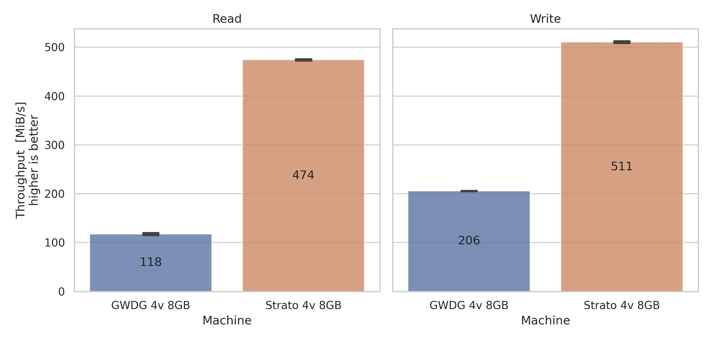

# Linux Benchmarking Framework
This repository contains Bash scripts to automate benchmarking linux machines regarding compute, memory, storage, and network performance.
The following benchmark tools are used to evaluate particular metrics:

| Metric             | Benchmark       | Version |
|--------------------|-----------------|---------|
| CPU performance    | Sysbench CPU    | 1.0.20  |
| Memory throughput  | Sysbench Memory | 1.0.20  |
| Storage throughput | fio (rnd & seq) | 3.28    |
| Network throughput | Iperf3          | 3.9     |

## Goal

Overall, this project aims at enabling users to make an informed decision 
whether certain cloud server offers are a good deal or not.

## Repository Content
- Shell scripts in `src/benchmark/` to:
  - perform benchmarks
  - write benchmark results into `.csv` files
- Python scripts in `src/plot/` to:
  - read the result files
  - create plots
- CSV result files in `data/`
- Log files in `logs/`
- Plot images in `plots/`

## Benchmarking Results

As an example, the following plot shows the read and write file I/O performance for sequential operations.
Here, we evaluated virtual private servers (VPS) from different providers.



> All plots and results are available in [RESULTS.md](RESULTS.md)
 
## Prerequisites
This setup has a few prerequisites regarding the local computer (e.g. laptop) that runs the main script 
and the server that should be evaluated.

### Local Computer Prerequisites
To test this project, we used Ubuntu 22.04 on the local computer.
In general, it should also work with other Linux distributions.

- `bash` is installed
- `ssh` is installed
- `python3` is installed
- The Python packages defined in [requirements.txt](requirements.txt) are installed
- Local computer can access the servers via ssh using the key `$HOME/.ssh/id_rsa`

### Server Prerequisites
During testing, we used Ubuntu 22.04 on the servers as well. 
In general, it should also work with other Linux distributions.

- `bash` is installed
- `jq` is installed
- `sysbench` is installed
- `fio` is installed
- `iperf3` is installed


## Getting Started
This repository contains a script [main.sh](src/main.sh). This script is designed to be executed locally, e.g., on a laptop. It
- connects to the server
- runs the benchmark
- copies the benchmark result file (`.csv`) as well as log files from the server to the local machine

Following command is an example for evaluating the server `141.5.100.173` using the `sysbench-cpu` benchmark:
```shell
# /bin/bash src/benchmark/main.sh <server-user> <server-ip> <machine> <benchmark>
/bin/bash src/benchmark/main.sh cloud 141.5.100.173 "AWS 4v 8GB" sysbench-cpu
```
After execution, the benchmark result file can be obtained in `data/` and the log files in `logs/`.

### Parameters

For execution, the script [main.sh](src/main.sh) requires multiple parameters in a specific order:

- Server User
- Server IP
- Machine
- Benchmarks

#### Server User

The first parameter specifies the linux user on the server that should be used in ssh.

#### Server IP

The second parameter sets the server ip that is used in ssh.

#### Machine

The third parameter is an arbitrary string that describes the machine under evaluation. 
Preferably this string is short and descriptive such as `AWS 4v 8GB`.

#### Benchmarks
The fourth parameter specifies the benchmark. The available benchmarks can be determined by the file names `workload-*.sh` inside the [workloads](src/benchmark/workloads) directories:
- `sysbench-cpu`
- `sysbench-memory`
- `fio-diskrnd`
- `fio-diskseq`
- `iperf3-bandwidth`
