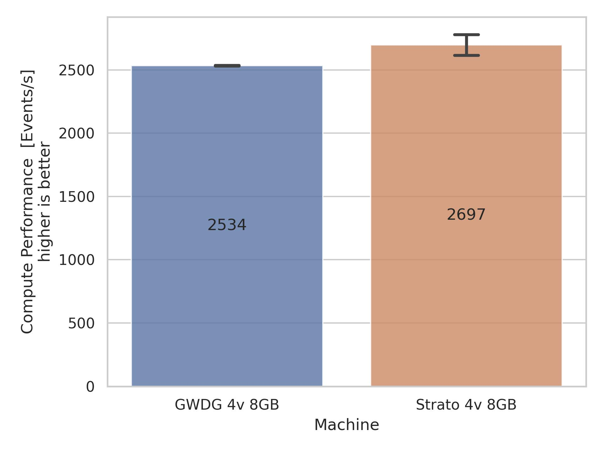
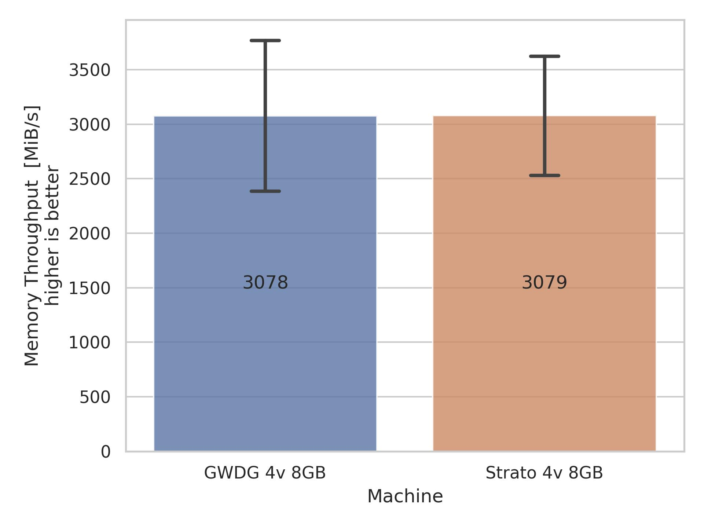
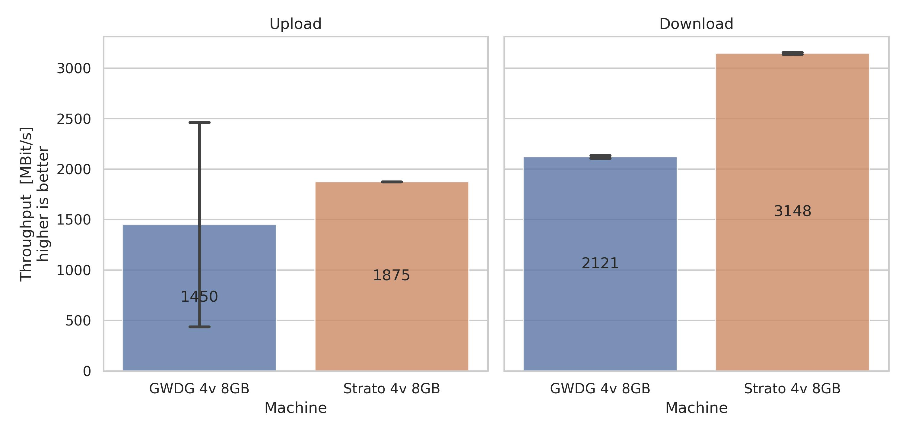
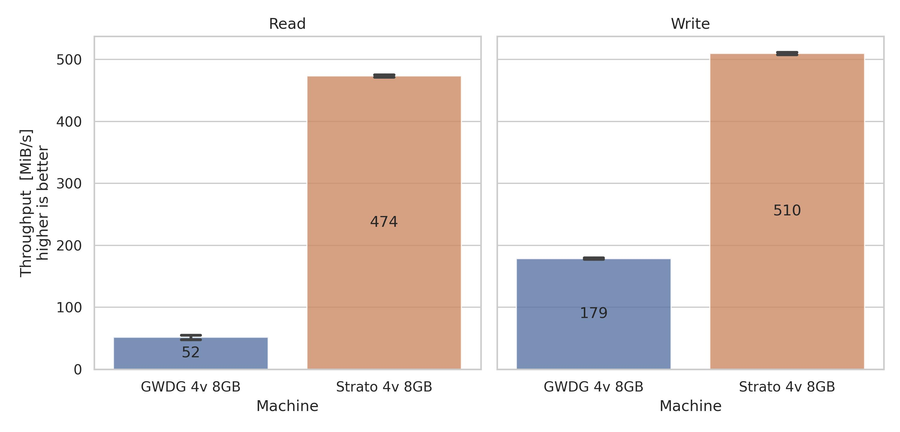

# Benchmark Results
We evaluated the following virtual private servers (VPS):

| Provider                                                             | vCores | Memory | Price / Month | Evaluation Date |
|----------------------------------------------------------------------|-------:|-------:|--------------:|-----------------|
| GWDG                                                                 |      4 |    8GB |           N/A | 2024-01-07      |
| [Strato (KVM Platform)](https://www.strato.de/server/linux-vserver/) |      4 |    8GB |            6€ | 2024-01-08      |

During the whole evaluation, the servers did not perform any other resource-consuming tasks.

## Compute Performance

The Sysbench CPU benchmark assesses the CPU performance by calculating prime numbers in a
multithreaded manner for a specific time.
The workload script [workload-sysbench-cpu.sh](src/benchmark/workloads/workload-sysbench-cpu.sh) specifies the actual command including all parameters.

## Memory Performance

The Sysbench memory benchmark is capable of evaluating the memory performance by reading or writing integers values to a memory block either in a sequential or randomized manner.
In our evaluation, we configured Sysbench to sequentially write to memory block.
The workload script [workload-sysbench-memory.sh](src/benchmark/workloads/workload-sysbench-memory.sh) specifies the actual command including all parameters.

## Network Bandwidth

The iPerf3 benchmark is capable of evaluating user-defined configurations
regarding timing, buffers and protocols. Regarding protocols, it supports Transmission
Control Protocol (TCP), User Datagram Protocol (UDP), and Stream Control Transmission Protocol (SCTP) - all with IPv4 and IPv6. In general, iPerf3 operates according to a
client-server model. 
We used iPerf3 to measure the maximum network bandwidth of the machine to a fixed public iPerf3 server.
The workload script [workload-iperf3-bandwidth.sh](src/benchmark/workloads/workload-iperf3-bandwidth.sh) specifies the actual command including all parameters.

## Storage Throughput

The fio benchmark allows to test various configurations and to obtain several metrics regarding file operations.
It features both, sequential and randomized read and write operations. 
Important parameters are the type of Input/Output (I/O) pattern defining whether sequential or randomized operations and whether read or write operations should be performed, the total file I/O size, and the block size. 
As a result, fio logs, among other details, the Input/Output operations Per Second (IOPS) and the throughput in MiB/s.
The workload scripts [workload-fio-diskseq.sh](src/benchmark/workloads/workload-fio-diskseq.sh) and [workload-fio-diskrnd.sh](src/benchmark/workloads/workload-fio-diskrnd.sh) specify the actual commands including all parameters.

### Sequential File Operations

### Randomized File Operations

## Discussion

In this evaluation, we assessed several important performance aspects of VPS. 
However, some aspects were not covered:
- Reliability, e.g., outages per year
- Memory latency
- Network latency
- Storage latency
- Other provider platform features, e.g., virtual private networks, firewalls, snapshot and backup capability, available OS images, etc.

## Sources
- Sysbench: https://github.com/akopytov/sysbench
- Fio: https://github.com/axboe/fio
- iPerf3: https://github.com/esnet/iperf
- iPerf3 public server list: https://github.com/R0GGER/public-iperf3-servers#europe
- Sysbench internal test details: https://rajanpanneerselvam.com/2021/11/06/sysbench-performance-tests/